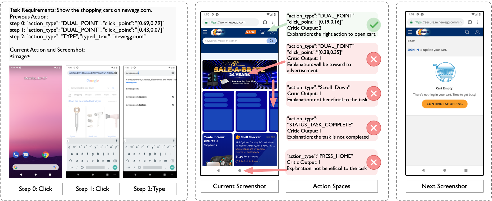

# VEM: Environment-Free Exploration for Training GUI Agent with Value Environment Model


[]()
[]()

**update**
- 2025.2: Release preprint in [arXiv](https://arxiv.org/abs/xx), and [page](https://microsoft.github.io/LAM-RL/)

<div align="center">
  
</div>

<div align="center">
  
</div>

## Quick Start

### step 1: environment
```angular2html
conda env create -f environment.yml
conda activate lam-rl

# if need to train critic model
git clone https://github.com/hiyouga/LLaMA-Factory.git
cd LLaMA-Factory
pip install -e ".[torch,metrics]" 
```

### step 2: prepare images and annotations
Download raw images from [https://box.nju.edu.cn/f/96ba5115bae24eaaa44e/](Seeclick page) and put it in `images/` and use your GPT-4o api(fill the TODO) to generate the labeled data, by running:
```angular2html
python3 data_preprocess/aitw.py
```

### step 3: prepare checkpoints
Download the checkpoints from [checkpoints/]
organize the files like this:
```angular2html
LAM-RL/
    data/
      aitw_anns/
    images/
      aitw_images/
    checkpoints/
      Auto-UI-Base/
      blip2-opt-2.7b/
      roberta-base/
      Qwen2-VL-7B-Instruct/
      critic_1218/merge-520
      rl-1227/epoch_13
      critic_shopping/merge-
      rl-webshop/epoch_13
```

#### step 3: training the critic model
```angular2html
sh scripts/train_critic.sh
sh scripts/critic_merge.sh
```

### step 4: training the policy model
```angular2html
sh scripts/train_policy.sh
```

### step 5: eval
```angular2html
# offline eval
sh scripts/eval_policy.sh
# online eval, build the android env according to the DigiRL page, get the url and filling it to configs/online_eval.yaml
sh scripts/eval_online.sh
```


## Citation
If you find this repository useful, please considering giving ⭐ or citing:
```
@article{
}
```

## Contributing

This project welcomes contributions and suggestions.  Most contributions require you to agree to a
Contributor License Agreement (CLA) declaring that you have the right to, and actually do, grant us
the rights to use your contribution. For details, visit https://cla.opensource.microsoft.com.

When you submit a pull request, a CLA bot will automatically determine whether you need to provide
a CLA and decorate the PR appropriately (e.g., status check, comment). Simply follow the instructions
provided by the bot. You will only need to do this once across all repos using our CLA.

This project has adopted the [Microsoft Open Source Code of Conduct](https://opensource.microsoft.com/codeofconduct/).
For more information see the [Code of Conduct FAQ](https://opensource.microsoft.com/codeofconduct/faq/) or
contact [opencode@microsoft.com](mailto:opencode@microsoft.com) with any additional questions or comments.

## Trademarks

This project may contain trademarks or logos for projects, products, or services. Authorized use of Microsoft 
trademarks or logos is subject to and must follow 
[Microsoft's Trademark & Brand Guidelines](https://www.microsoft.com/en-us/legal/intellectualproperty/trademarks/usage/general).
Use of Microsoft trademarks or logos in modified versions of this project must not cause confusion or imply Microsoft sponsorship.
Any use of third-party trademarks or logos are subject to those third-party's policies.
