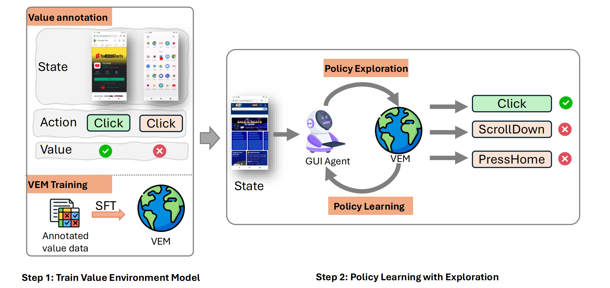

# VEM: Environment-Free Exploration for Training GUI Agent with Value Environment Model

[]()
[]()

We propose an environment-free RL framework that decouples value estimation from policy optimization by leveraging a pretrained Value Environment Model (VEM). VEM predicts state-action values directly from offline data, distilling human-like priors about GUI interaction outcomes without requiring next-state prediction or environmental feedback. The framework operates in two stages: (1) pretraining VEM to estimate long-term action utilities and (2) guiding policy exploration with frozen VEM signals, enabling layout-agnostic GUI automation.

**update**
- 2025.2: Release preprint in [arXiv](https://arxiv.org/abs/xx), and [page](https://microsoft.github.io/LAM-RL/)

<div align="center">
  
</div>

<div align="center">
  
</div>

## Quick Start

### step 1: build environment
```angular2html
conda env create -f environment.yml
conda activate lam-rl

git clone https://github.com/hiyouga/LLaMA-Factory.git
cd LLaMA-Factory
pip install -e ".[torch,metrics]"
```

### step 2: prepare images and annotations
- Download raw images from [seeclick website](https://box.nju.edu.cn/f/96ba5115bae24eaaa44e/) and put them under `images/aitw_images`
- To get the labeled data for training critic model, please fill the `api_key` and `model_name` in `configs/gpt_config.yaml` 
- then running `python3 data_preprocess/aitw.py`, you can get the data for training critic model and policy model.

### step 3: prepare checkpoints
Download the checkpoints from [Auto-UI-Base](https://huggingface.co/cooelf/Auto-UI/tree/main)(choose the base version), [blip2-opt-2.7b](https://huggingface.co/Salesforce/blip2-opt-2.7b), [roberta-base](https://huggingface.co/FacebookAI/roberta-base), [Qwen2-VL-7B-Instruct](https://huggingface.co/Qwen/Qwen2-VL-7B-Instruct)

Then organize all the files like this:
```angular2html
GUI-Agent-RL/
    data/
      aitw_anns/
    images/
      aitw_images/
    checkpoints/
      Auto-UI-Base/
      blip2-opt-2.7b/
      roberta-base/
      Qwen2-VL-7B-Instruct/
```

### step 4: training the critic model
We use the LLaMA-Factory to training the critic model,  base on our setting, there need 8 A100, and using the lora to train.
- To get the checkpoint of critic model of AITW general task, run `sh scripts/train_critic_general.sh`, then the critic checkpoints will store in `checkpoints/critic_general`
- To get the checkpoint of critic model of AITW webshopping task, run `sh scripts/train_critic_webshopping.sh`, then the critic checkpoints will store in `checkpoints/critic_webshopping`

You can modify the output path by modifying the `output_dir` in yaml. And remember to fill the  `adapter_name_or_path` and `export_dir` in configs/critic_merge.yaml when you running the lora merge.

### step 5: training the policy model
After getting the critic model, we use the AutoGUI as the base policy model for training, to training the model on general dataset, running:
```angular2html
python3 train.py --task general
python3 train.py --task webshopping
```
checkpoints save at `checkpoints/policy_general` and `checkpoints/policy_webshopping` by default.

### step 6: eval
- offline eval
```angular2html
python3 train.py --task general --eval
python3 train.py --task webshopping --eval
```
- online eval: 
  - build the android env following this [page](https://github.com/DigiRL-agent/digirl/tree/master/env_setup), get the url, then fill the `appium_server_url` in `configs/online_eval.yaml`
  - run the agent demo by `python3 models/demo.py --model_path xxx`, get the gradio public url and fill the `agent_url` in `configs/online_eval_general.yaml` or `configs/online_eval_webshopping.yaml`
  - `python3 eval_online.py --task general` or `python3 eval_online.py --task webshopping`

## Citation
If you find this repository useful, please considering giving ⭐ or citing:
```
@article{
}
```

## Contributing

This project welcomes contributions and suggestions.  Most contributions require you to agree to a
Contributor License Agreement (CLA) declaring that you have the right to, and actually do, grant us
the rights to use your contribution. For details, visit https://cla.opensource.microsoft.com.

When you submit a pull request, a CLA bot will automatically determine whether you need to provide
a CLA and decorate the PR appropriately (e.g., status check, comment). Simply follow the instructions
provided by the bot. You will only need to do this once across all repos using our CLA.

This project has adopted the [Microsoft Open Source Code of Conduct](https://opensource.microsoft.com/codeofconduct/).
For more information see the [Code of Conduct FAQ](https://opensource.microsoft.com/codeofconduct/faq/) or
contact [opencode@microsoft.com](mailto:opencode@microsoft.com) with any additional questions or comments.

## Trademarks

This project may contain trademarks or logos for projects, products, or services. Authorized use of Microsoft 
trademarks or logos is subject to and must follow 
[Microsoft's Trademark & Brand Guidelines](https://www.microsoft.com/en-us/legal/intellectualproperty/trademarks/usage/general).
Use of Microsoft trademarks or logos in modified versions of this project must not cause confusion or imply Microsoft sponsorship.
Any use of third-party trademarks or logos are subject to those third-party's policies.
